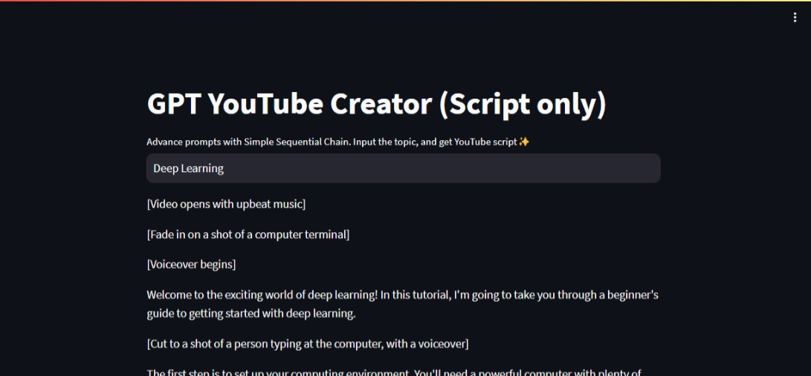
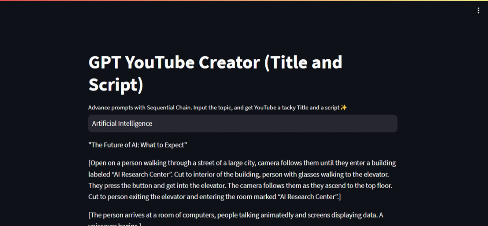

# Building our own AutoGPT with the help of LangChain and GPT-3

Notes:

STREAMLIT - USED TO BUILD THE APP
LANGCHAIN- USED TO BUILD LLM WORKFLOW
OPENAI - NEEDED TO USE OPENAI GPT
WIKIPEDIA- USED TO CONNECT GPT TO WIKIPEDIA
CHROMADB - VECTOR STORAGE
TIKTOKEN - BACKEND TOKENIZER FOR OPENAI

## Run the app

Download the repo:
[Link](https://github.com/)

1. Install dependencies:

    ```bash
    pip install -r requirements.txt
    ```

2. Insert your GPT-3 apikey
    In the project directory, create a file `apikey.py` and paste in the following content

    ```python
    apikey = 'YOUR_OPENAI_API_KEY'
    ```

    Replace `YOUR_OPENAI_API_KEY` with your OpenAI key.

    Save the file.

    > [!IMPORTANT]
    > Make sure you add the `apikey.py` this file to `.gitignore`.

3. To run the code, type in terminal

    ```bash
    streamlit run app.py
    ```

## Types of use case

### 1. With user input prompts

Refer [app.py](app.py)

To run [app.py](app.py)
    ```bash
    streamlit run app.py
    ```


### 2. Prompt templates

dynamic prompting

For example:

```
Write a conversational play on {topic}
```

The `Write a converstational play on` is part of the template, and `{topic}` is variable with user input from the user interface.

> You can change the prompt template to your own custom prompt on line number 19 of `app_pro_tem.py`

To run [app_pro_tem.py](app_pro_tem.py)
    ```bash
    streamlit run app_pro_tem.py
    ```

### 3. Simple Sequential Chains

Refer [app_sim_seq_chain.py](app_sim_seq_chain.py)

Simple Sequential prompting, that is, you can chain up multiple prompts that works together to give you multuiple output.

prompt 1: `'Write a unique title for conversational play on {topic}'`

prompt 2: `'Write a conversational play script with atleast 10 dialogues on TITLE: {title}'`

These prompts run sequentionally to provide multiple outputs.



> [!NOTE]
> **Simple Sequential chain** only dispalys the output of the last chain on the web app, whereas to get the output of all our desired chains on our web app we can use **Sequential chain**

### 4. Sequential Chains

Here you can see the title as well as the script



### 5. Adding buffer memory (for storing the history) to our LLM using langchain

### 6. Integrating Wikipedia research tool in our application

