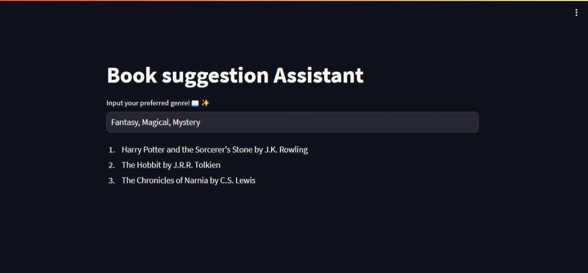

# Building our own AutoGPT with the help of LangChain and GPT-3

## Overview

This repository contains code to build a text generation app using the LangChain library and OpenAI's GPT-3 model. The app is built using Streamlit, a Python library for creating web applications. The LangChain library is used to manage the LLM (Language Model Management) workflow, and OpenAI is used to access the GPT-3 model.

For a detailed explanation of the code and get the basics of LangChain, read [blog](hashnode) 🚀

## Run the App

To run the app locally, follow these steps:

1. Clone the repository:

2. Install the required dependencies:

    ```bash
    pip install -r requirements.txt
    ```

3. Insert your GPT-3 API key:

    - In the project directory, create a file named `apikey.py`.
    - Inside `apikey.py`, paste the following content:

        ```python
        apikey = 'YOUR_OPENAI_API_KEY'
        ```

        Replace `YOUR_OPENAI_API_KEY` with your actual OpenAI API key.
    - Save the `apikey.py` file.

> [!IMPORTANT] 
> Make sure to add `apikey.py` to your `.gitignore` file to avoid exposing your API key.

4. Run the Streamlit app:

    ```bash
    streamlit run app.py
    ```

    Your application should be live on http://localhost:8501/

## Different Use Cases

This repository explores four features of Langchain to get a better understanding of the basics of Langchain:

1. [User Input Prompts](https://docs.langchain.com/docs/components/prompts/prompt-value)
2. [Prompt Templates](https://docs.langchain.com/docs/components/prompts/prompt-template)
3. [Simple Sequential Chains](https://python.langchain.com/docs/modules/chains/foundational/sequential_chains)
4. [Sequential Chains](https://python.langchain.com/docs/modules/chains/foundational/sequential_chains)

### 1. [User Input Prompts](app.py)

> Refer to [app.py](app.py) for the implementation of user input prompts.

This codebase implements the basic feature of LLM with the help of LangChain. A user input prompt is a piece of text that is used to guide an LLM to generate text. The prompt can be as simple as a single sentence or as complex as a paragraph.

Run the user input prompt app:

```bash
streamlit run app.py
```


### 2. [Prompt Templates](app_pro_tem.py)

> Refer to [app_pro_tem.py](app_pro_tem.py) for the implementation of Prompt Templates

This codebase implements the basic feature of LLM with the help of LangChain. Prompt Template is a piece of text that can be used to generate different prompts by filling in the placeholders with different values.

For example:

```
Write a conversational play on {topic}
```

The user can input the just the topic in the text box on web app.



To customize the prompt template, edit line number 19 of `app_pro_tem.py`.

Run the prompt template app:

```bash
streamlit run app_pro_tem.py
```

### 3. [Simple Sequential Chains](app_sim_seq_chain.py)

> Refer to [app_sim_seq_chain.py](app_sim_seq_chain.py) for simple sequential prompting.

A simple sequential chain is a sequence of prompts that are executed one after the other. Each prompt in the chain is used to generate text, and the output of one prompt is used as the input for the next prompt

Run the simple sequential chain app:

```bash
streamlit run app_sim_seq_chain.py
```


> [!NOTE]
> **Simple Sequential chain** only dispalys the output of the last chain on the web app, whereas to get the output of all our desired chains on our web app we use **Sequential chain**


### 4. [Sequential Chains](app_sim_seq_chain.py)

> Refer to [app_sim_seq_chain.py](app_sim_seq_chain.py) for implementation of sequential prompting.

Sequential chains allow you to take the output of one prompt and use it as the input for another prompt. This can be used to generate text that is more complex than what can be generated by a single prompt.

```bash
streamlit run app_seq_chain.py
```

Display both title and script in sequential chains.

Example:


---

For a detailed explanation of the code and get the basics of LangChain, read [blog](hashnode)